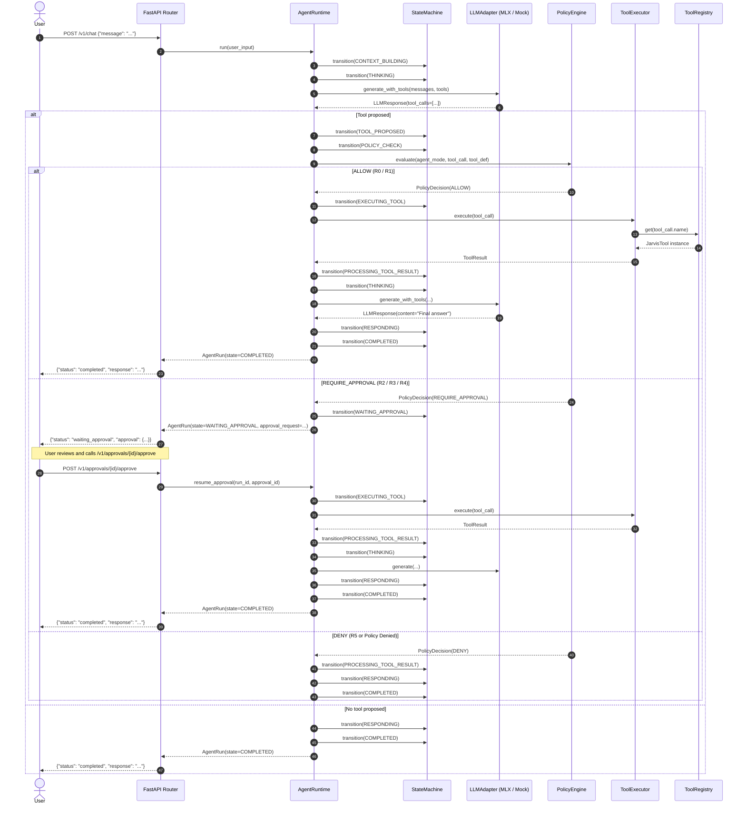

# Jarvis V1 — Milestone 1 Architecture

## Overview

Jarvis V1 Milestone 1 establishes a local-first, autonomous AI agent core for macOS. It executes small-footprint quantized models (specifically Qwen3.5-4B MLX 4-bit) on Apple Silicon, interacts with tools through explicit type-safe definitions, and enforces a non-bypassable, deterministic Policy Engine for safety and human-in-the-loop approvals.

## Core Architectural Principles

1. **Local-First & Privacy Preserving**:
   - Model execution runs natively on Apple Silicon using MLX.
   - User context, tool execution, and decision logic remain entirely on the local device (`127.0.0.1`).
   - Logging defaults to metadata-first to eliminate sensitive content exposure.

2. **Decoupled LLM Adapter Layer**:
   - The Agent Runtime depends purely on the abstract `LLMAdapter` contract.
   - LLM providers or local backends (MLX, Mock, etc.) can be swapped without altering agent state, tool execution, or safety verification.

3. **Deterministic Policy Engine & Guardrails**:
   - The LLM *never* executes tools directly.
   - The LLM proposes actions (`ToolCall`), which are passed through the `PolicyEngine`.
   - The Policy Engine assigns decisions based on strictly defined risk levels (`R0` to `R5`) and current `AgentMode`.
   - High-risk operations (`R2`-`R4`) require explicit user approval (`WAITING_APPROVAL`), and destructive/sensitive operations (`R5`) are denied outright.

4. **Strict State Machine**:
   - Every agent run transitions across explicit states (`CREATED` -> `CONTEXT_BUILDING` -> `THINKING` -> `TOOL_PROPOSED` -> `POLICY_CHECK` -> `WAITING_APPROVAL` / `EXECUTING_TOOL` -> `PROCESSING_TOOL_RESULT` -> `RESPONDING` -> `COMPLETED` / `FAILED` / `CANCELLED`).
   - Illegal state jumps raise `AgentStateError`.

5. **Pydantic-Driven Validation & Idempotency**:
   - All tool arguments are parsed and validated via Pydantic schemas.
   - Tool calls carry unique IDs, preventing duplicate executions within a run.

## System Sequence

